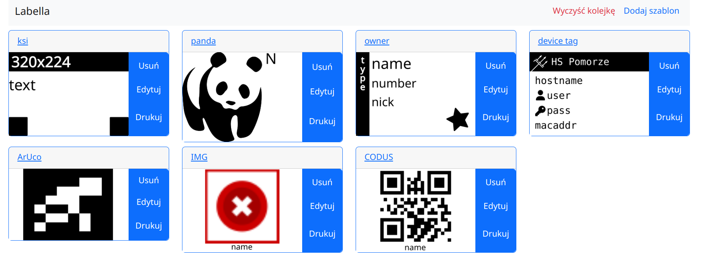
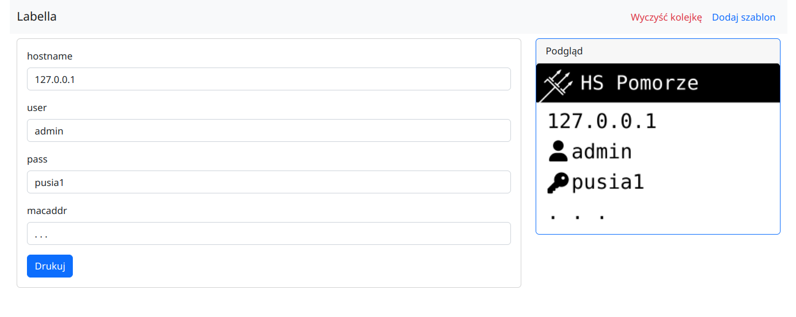
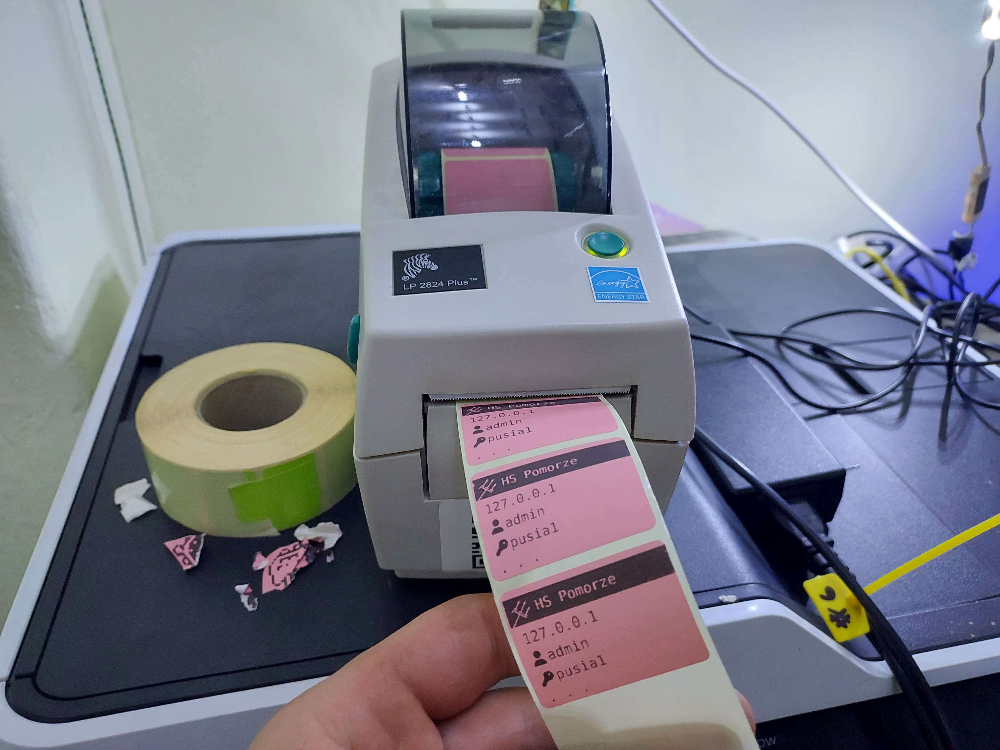

# LABELLA

is a labello done right.  
No idea what a labello is?  
Good.

## What is it

It is a templating and printing application for Zebra/EPL printers + anything you want to add to this project.   
You want to create a modificable image?: Just use '${name}' inside the svg file.  
You want to generate a qr code?: use qrCode attribute on image node in svg file.  
But images speak better:





Just tinker with it and as things, so I can add to FAQ.

## Features and quirks

### Jinjava (jinja) under the mask

You a python developer?  
Not knowing how to code with class?  
Just hack your way with writing tons of jinja markup in your svgs.  

Very important that all template inputs are just "{{nameOfVariable}}" inside the svg.  
Download one to see it with your own eyes.

### Many SVGs in one SVG

If you edit your svg file to look like:
```
<svgs>
    <svg>...</svg>
    <svg>...</svg>
<svgs>
```
then all svgs inside the `<svgs>` will be printed separately.
Great feature to wasting tons of paper by one template.

### Size extraction from your svg

It will extract size to print from your xs and ys of svg file.
See `SvgSizeExtractorImpl.kt` for reference.

### SVGFlavors and qrCode generation
See `QRCodeFlavor.kt`.
In short adding `qrCode` attribute to your `<image>` will convert it to qrCode.
It is very naive implementation and it will generate very poor quality qrCode.
TODO: Try to change it to svg generator.

## RUNNING

See [backend readme](./backend/README.md) for referenced sections...  

Use the docker from the root catalog, see *Quickstart* how to run it...  
You can also run it without the docker, then use just `./gettobuild` and follow *Production* section.


### DEVELOPMENT


See [backend readme - Developer Start](./backend/README.md) for more info.  

and

See [frontend dev](./froncik/DEV.md) for more info.  


### Prerequisites
- Node: v16.16.0
- Java: openjdk version "11.0.17" 2022-10-18
- Mvn: Apache Maven 3.8.5 (3599d3414f046de2324203b78ddcf9b5e4388aa0)
- Linux
- Inkscape 1.2.1 (not matching this version may give your image glitches and stitches)
- Lp 

Or just run it via docker and save yourself du pain.


