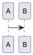

# QUICKSTART
Just use docker, not sure though if it will work.

To build: `docker build . -t labella`.  
To run: ```docker run -e printerName=ZPL_ZPL_Label_Printer -e LABEL_WIDTH=465 -e LABEL_HEIGHT=356  --net=host -v "`pwd`/data:/data:rw" labella```.  
You may need to use `--priviliged` in podman PLS FIX.


# Developer start
You should just run it as a normal java developer.  
You are not? Lol, use `mvn spring-boot:run -DprinterName=ZebraCups`.  
Change the `-DprinterName=???` variable to the printer name in your CUPS or something.  
See the code in LpCliLanguagePrinterService if it ain't working, lol.
Prolly need Inkscape, lp and whatsnot, errors will guide you gl;hf.

## Development

We are using Hexagon here.  
In model sleeps ddd.  
There are noun named services that are building bricks.  
There are verb named services which execute business case.  
Of course there are also controllers.  
TemplateCRUD is a controller, and a repository - Spring Data Rest magic.  
MainConfiguration constructs whole application + Spring Scanning magic for Controllers and Repositories.

The more you know Spring the better.

### Convention in deep



## Production

If you are running it outside the docker, then please run:
`java -jar -Dspring.datasource.url=jdbc:h2:file:./path/to/labella/db -DprinterName=??? -Dserver.port=8080 -Dlabel.width=??? -Dlabel.height=??? app.jar`
Best build by gettobuild.sh, it will build also frontend.
